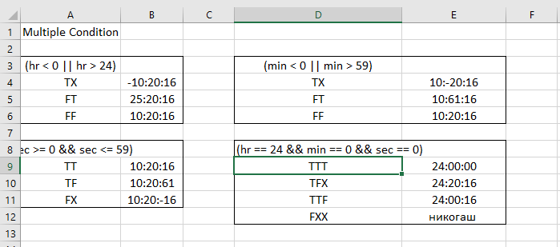
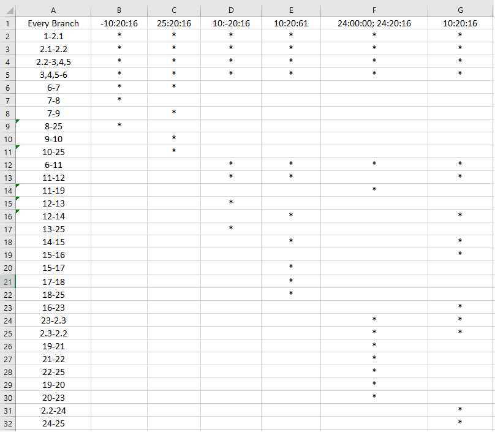

Лабораториска вежба 2 по Софтверско Инженерство
Мила Лекоска 196052

1. 

3. Цикломатската комплексност е:
   E + N - 2 = 31 - 25 + 2 = 8   
   E=>ребра                      
   N=>јазли
   
   Предикатни јазли = 7
   P + 1 = 7 + 1 = 8

=> Цикломатската комплексност е 8.

4. Multiple condition:
   Со ова тестирање ги проверуваме сите можни опции во условите.
   Од веќе направените тестови за Every Branch додаваме само неколку дополнителни тестови.
   Во условот (hr == 24 && min == 0 && sec == 0) опцијата FXX никогаш нема да се случи бидејќи ако часот е различен од 24 никогаш нема да стигне до овој if услов ќе влезе во еден од погорните услови.

-Покриеноста од овие тест примери е прикажана на сликата со табела.

5. Every Branch
   За да ја покриеме секоја гранка од Control Flow Graph потребни ни се 6 тест примери. Тоа е така бидејќи имаме 5 типа на Exceptions и ни треба уште еден излез кога програмата нормално завршува.

-Покриеноста од овие тестови е прикажана на сликата со табела.

6. За нормален излез на програмата, без Exception користев assertEquals()  каде се проверува дали очекуваниот резултат од функцијата одговара со вистинскиот резултат за даден влез. Ако тоа е исполнето тестот е поминат, ако не тестот паѓа.

За случаите каде програмата излегува со Exception користев assertThrows() за да видиме кој тип на Exception фрла програмата, и фрлениот Exception го споредуваме со очекуваниот Exception со assertTrue(). Ако пораките од Exception се софпаѓаат тестот е поминат.

